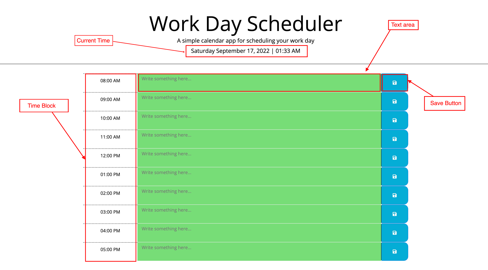

# Work Day Scheduler by RS

## Your Task

This project is a simple calendar application (Daily Planner) that allows a user to save events for each hour of the day. The goat is to create daily work schedules for each working hour of the day.

When using this application, the current Day and time is displayed at the top of the page using Moment.js library, then displayed the 8 hours time blocks from 8am to 5pm. Each time block is color coded like if the current time past the time block, then the block color changes to grey, if the current time matched the time block, then the block color changes to red, if the current time is less than the time block, then the block color changes to green.

Below it the screen shots of the apps:

## Links

Below is the link related to the project:

- Project Homepage: https://rochak-ms.github.io/work-DayScheduler/
- Repository: https://github.com/rochak-ms/work-DayScheduler.git

# Usage

To use this Website, you can review the codes in each section. For looking what changes is being made, open the Chrome DevTools by pressing Command+Option+I (macOS) or Control+Shift+I (Windows). A console panel should open either below or to the side of the webpage in the browser. There you will see comment have been added with the changes being made.

## Credits

- Bootstrap,
- Jquery,
- Moment.js

## License

- MIT License
